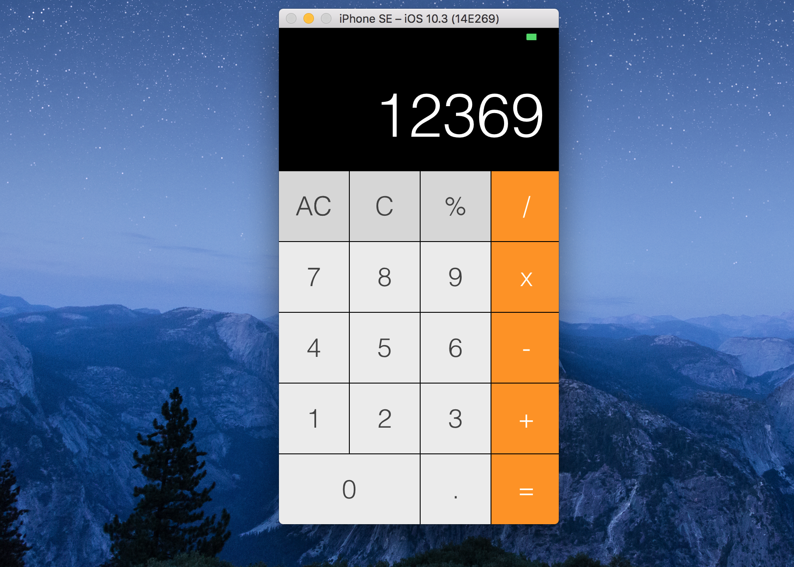

# Swift 3
This is a repository where I will storage all the basics about Swift 3 and XCode 8

## Intro
Contains basic about Swift 3 ( operators, statements, loops, arrays)
## Calculator
Basic tutorial developing a calculator for iPhone SE / 5s

## Udacity
